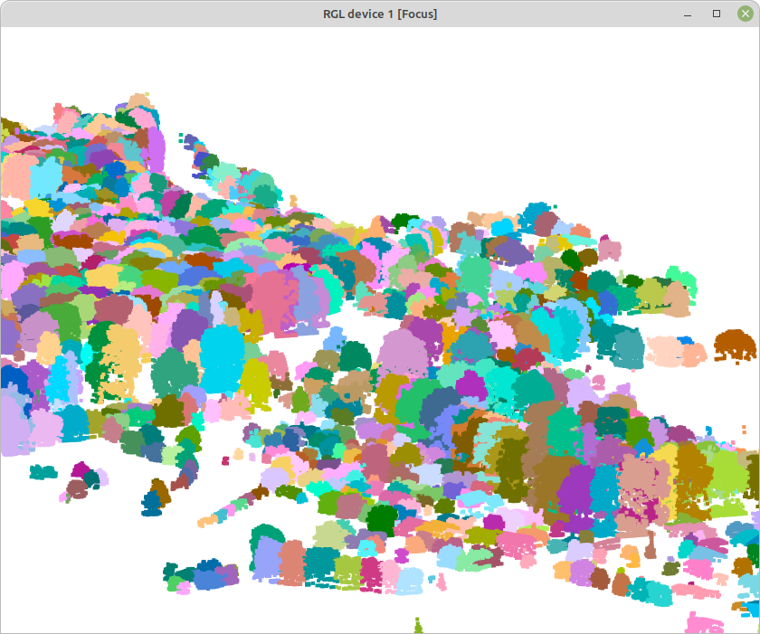

```{r setup, include=FALSE}
knitr::opts_chunk$set(
	echo = TRUE,
	message = FALSE,
	warning = FALSE
)
```

## Medidas de estructura de la vegetación (arbórea y arbustiva) vía LiDAR en el [Jardín Botánico Atlántico de Gijón](https://www.gijon.es/es/directorio/jardin-botanico-atlantico-de-gijon)

(usa ctrl + click para abrir enlaces en una nueva pestaña).

Procedimiento desarrollado con la librería *lidR*, siguiendo en gran medida las [rutinas descritas por el autor de la misma](https://github.com/r-lidar/lidR).

```{r}
library(lidR)
```

La librería permite leer y escribir los formatos .las y .laz, e incluye funciones a distinto nivel de organización de datos.

Los datos necesarios para desarrollar este ejemplo son tres archivos .laz de nubes de puntos LiDAR 3D, [descargados del IGN](https://centrodedescargas.cnig.es/CentroDescargas/busquedaSerie.do?codSerie=MLID2#). Cada archivo cubre 2 x 2 km, e incluyen coloración verdadera (RGB). Están incluidos [en la carpeta comprimida 2catalog_botanico.zip](https://www.dropbox.com/scl/fi/keaer5i67xc6p8toqna9d/2catalog_botanico.zip?rlkey=eb3tmq74au5i71wx3pnnrstdk&dl=0) El comando `catalog` a continuación construye un mosaico virtual de las 3 coberturas 2 x 2 km:

```{r}
mosaico.botanico <- catalog("2catalog_botanico")
```

Un `catalog` es un esquema simple de los datos disponibles, que ocupando muy poca memoria permite trabajar con varios archivos .laz (o .las):

```{r plot mosaico}
plot(mosaico.botanico)
```

La **extracción** de partes del mosaico se puede realizar con las distintas funciones `clip`disponibles en **lidR**.

A continuación, dos ejemplos: un fragmento circular de la Carbayeda, y un rectángulo de datos incluyendo todos los terrenos del Botánico. Las coordenadas son las originales del conjunto de datos, en este caso UTM 30N. En ambos casos la función `plot` muestra y permite rotar e inclinar la nube de puntos:

```{r plot carbayeda}
carbayeda <- clip_circle(mosaico.botanico, 288115, 4821807, radius = 50)
plot(carbayeda) 
```


```{r plot botanico}
todo.botanico <- clip_rectangle(mosaico.botanico, 287676,4821673, 288937,4822128)  
plot(todo.botanico, bg="white") 
```


Los autores de la librería **lidR** (enlace arriba) tienen también un visor de nubes de puntos mucho más ágil, si bien a diferencia del estándar requiere cerrar el visor antes de procesar más código R; requiere la instalación de [la librería adicional *lidRviewer*](https://github.com/Jean-Romain/lidRviewer):

```{r eval=FALSE}
plot(todo.botanico, backend="lidRviewer") # default = Z
```

A continuación podemos usar funciones para evaluar la condición general del conjunto de datos. Concretamente `las_check()` repasa diversos indicadores interesantes, entre ellos si los datos están normalizados (más detalle debajo), o si existen muchos puntos duplicados.

```{r lascheck, eval=FALSE}
las_check(todo.botanico)
str(todo.botanico@data)
summary(todo.botanico$Z)
```

Esa estadística descriptiva simple se refiere a la variable **Z** de los datos: la altura de los puntos sobre el nivel del mar, incluyendo el terreno y la vegetación.

### Normalizando alturas de la vegetación

Para analizr estructura de la vegetación puede ser interesante **normalizar las nubes de puntos**, eliminando la influencia de la altura del terreno. Es el cometido de la función`normalize_height`, [que admite distintos métodos](https://r-lidar.github.io/lidRbook/norm.html).

Tras normalizar los datos podemos aplicar `las_check` de nuevo, así como repasar la nueva distribución de valores de alturas (Z):

```{r}
todo.botanico.norm <- normalize_height(todo.botanico, tin())
summary(todo.botanico.norm$Z)
```

La nueva descriptiva muestra un valor mínimo negativo. Dado que en los valores no normalizados de altura no había valores menores de 0, los valores normalizados negativos son artefactos de la triangulación (asumo que debidos a bajas densidades de puntos "suelo", pero no estoy seguro). En todo caso, podemos prescindir de esos artefactos filtrando los valores de altura de las nube de puntos normalizada:

```{r plot botanico norm, eval=c(1)}
todo.botanico.norm <- filter_poi(todo.botanico.norm, Z >= 0)
plot(todo.botanico.norm, bg = "white", backend="lidRviewer")
```

### Modelo de alturas del dosel

A continuación elaboramos un modelo de altura del dosel. Será una cobertura [en formato ráster](https://docs.qgis.org/3.28/es/docs/gentle_gis_introduction/raster_data.html) representando los puntos más altos de los retornos, la altura del dosel. Hay varios algoritmos posobles para obtener esos modelos; el código a continuación usa \*\*point to raster\*`**, especificado en`p2r()`, donde el argumento`subcircle = 0.2\` reemplaza cada punto con un disco de radio conocido (20 cm), minimizando los blancos:

```{r modelo dosel}
dosel.modelo <- rasterize_canopy(todo.botanico.norm, res=1, p2r(subcircle = 0.2), pkg="terra")
plot(dosel.modelo, col = height.colors(50))
```

### Suavizado del modelo - rellenando blancos

A continuación procesamos el modelo de altura del dosel para suavizarlo, y rellenar blancos restantes. Las dos primeras líneas de código a continuación definen la función de suavizado, mientras que la 3ª lo lleva a cabo a través de la librería de manipulación ráster **terra**. La última línea exporta el ráster a un archivo GeoTiff - también vía **terra** - dejándolo disponible para usos en GIS:

```{r suave}
fill.na <- function(x, i=5) { if (is.na(x)[i]) { return(mean(x, na.rm = TRUE)) } 
  else { return(x[i]) }}
w <- matrix(1, 3, 3)
dosel.modelo.suave <- terra::focal (dosel.modelo, w, fun = mean, na.rm = TRUE)
terra::writeRaster(dosel.modelo.suave, "dosel.modelo.tif", overwrite=T)
```

### Detección de árboles

*lmf 2 chm*

```{r detecta copas, eval=c(1)}
copas.p2r.02 <- locate_trees(dosel.modelo.suave, lmf(ws = 10))  
plot(dosel.modelo.suave, col = height.colors(50))
plot(sf::st_geometry(copas.p2r.02), add = TRUE, pch = 3)
```

### Segmentación de los árboles detectados

**EXPLICAR...**

```{r segmenta copas}
segmentos <- dalponte2016(dosel.modelo.suave, copas.p2r.02)
copas <- segment_trees (todo.botanico.norm, segmentos)
```

```{r reten solo arbol}
arboles <- filter_poi(copas, !is.na(treeID))
summary(arboles$Z)
plot(arboles, bg = "white", size = 4, color = "treeID")
```



### Extrayendo árboles individuales

```{r extrae okalito}
okaliton <- filter_poi(arboles, treeID == 747)
plot(okaliton, size = 6, bg = "black")
```


Una vez extraidos, esos modelos individuales de árboles son nubes de datos, de las que podemos extraer información de la manera habitual: `summary()` nos puede devolver información sobre la propia nube de puntos, y sobre variables concretas en ella, como la altura (Z).

```{r okaliton 2, eval=c(2), echo=1:2}
summary(okaliton)
summary(okaliton@data$Z)
```

### Extrayendo métricas

####  A nivel de árbol
La función `crown_metrics()` devuelve métricas de árboles (copas) individuales. La función incluye al menos dos argumentos - la nube de puntos de interés, y la función a extraer; en este primer caso, la media de altura de cada árbol:
```{r}
Z.media.arbol <- crown_metrics(arboles, func = ~mean(Z))
```

A continuación operamos simplemente para renombrar la variable 'media' obtenida:
```{r}
Z.media.arbol$zmedia <- Z.media.arbol$V1
Z.media.arbol$V1 <- NULL
head(Z.media.arbol)
```

De la misma forma obtenemos la altura máxima, la desviación estándar de Z, y el número de retornos de los pusos LiDAR por cada árbol:
```{r}
Z.max.arbol <- crown_metrics(arboles, func = ~max(Z))
Z.max.arbol$zmax <- Z.max.arbol$V1
Z.max.arbol$V1 <- NULL

Z.sd.arbol <- crown_metrics(arboles, func = ~sd(Z))
Z.sd.arbol$zsd <- Z.sd.arbol$V1
Z.sd.arbol$V1 <- NULL

n.retornos <- crown_metrics(arboles, func = ~length(ReturnNumber))
n.retornos$nretornos <- n.retornos$V1
n.retornos$V1 <- NULL
```


Finalmente combinamos las métricas extraidas en un único conjunto de datos, reteniendo solo las columnas de interés:
```{r}
arboles.metrica <- cbind(Z.media.arbol, Z.max.arbol, Z.sd.arbol, n.retornos)
arboles.metrica <- arboles.metrica[,c(1,2,4,6,8,9)]
head(arboles.metrica)
```

El procedimiento anterior se puede simplificar: las métricas más comunes están pre-definidas en el argumento `func = .stdmetrics`, si bien esa opción ofrece una salida muy prolija:
```{r results='hide'}
arboles.metrica.2 <- crown_metrics(arboles, func = .stdmetrics)
```

####  A nivel de parcela
Puede resulta útul en ocasiones evaluar la estructura de la vegetación en una parcela de tamaño determinado. Es procedimiento habitual en inventarios forestales, y es frecuente también cuando evaluamos el uso de hábitat por parte de animales. En este caso utilizaremos 4 puntos de interés, para los que tenemos grabaciones de vocalizaciones de aves.
La librería **LiDR** incluye la función `plot_metrics()` para facilitar la extracción de métricas *tipo inventario*. La función requiere especificar la nube de puntos LiDAR, las métricas que queremos extraer, la localización de las parcelas, y el radio de las mismas. 
Para manejar la localización de las parcelas, importamos una capa de puntos, en este caso 4; el formato utilizado es el viejo formato vectorial *shapefile* (extensión *shp*), disponible en [parcelas.zip](https://github.com/quevedomario/dosel-botanico/tree/main) en este repositorio:  
```{r}
parcelas <- sf::st_read("parcelas.shp", quiet = TRUE)
```

A continuación pedimos por eficiencia el lote completo de métrica estándar visto arriba, del que nos interesan solo unas pocas variables, con parcelas de 20 m de radio (1257 m2). Las tres primeras métricas disponibles son *zmax*, *zmean*, y *zsd*, i.e. altura máxima, media, y desviación estándar en cada parcela: 
```{r}
metricas <- plot_metrics(todo.botanico.norm, func = .stdmetrics, parcelas, radius = 20)
head(metricas)
```