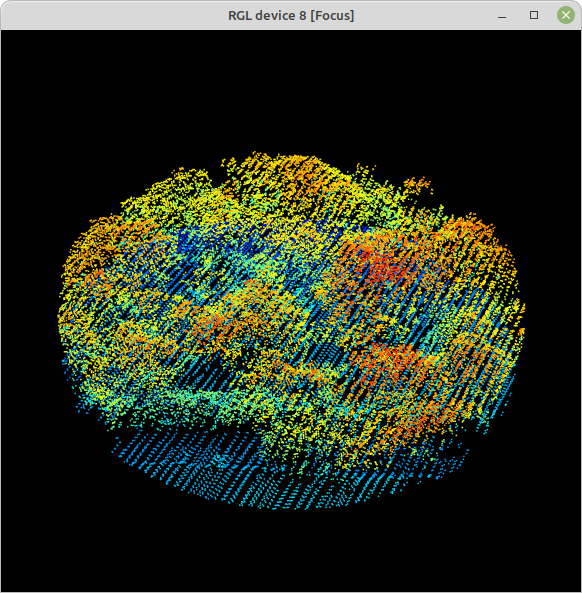
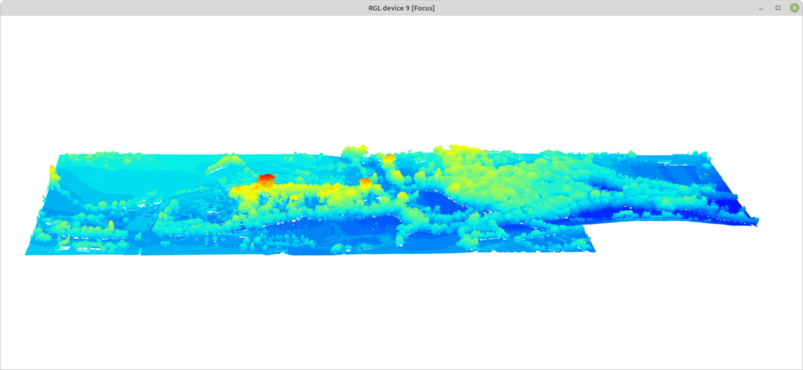

```{r setup, include=FALSE}
knitr::opts_chunk$set(
	echo = TRUE,
	message = FALSE,
	warning = FALSE
)
```

## Estructura de la vegetación (arbórea y arbustiva) en el [Jardín Botánico Atlántico de Gijón](https://www.gijon.es/es/directorio/jardin-botanico-atlantico-de-gijon)

Procedimiento desarrollado con la librería *lidR*, siguiendo en gran medida las [rutinas descritas por el autor de la misma](https://github.com/r-lidar/lidR).

```{r}
library(lidR)
```

La librería permite leer y escribir los formatos .las y .laz, e incluye funciones a distinto nivel de organización de datos.

Los datos necesarios para desarrollar este ejemplo son tres archivos .laz de nubes de puntos LiDAR 3D, [descargados del IGN](https://centrodedescargas.cnig.es/CentroDescargas/busquedaSerie.do?codSerie=MLID2#). Cada archivo cubre 2 x 2 km, e incluyen coloración verdadera (RGB). Están incluidos [en la carpeta comprimida 2catalog_botanico.zip](https://www.dropbox.com/scl/fi/keaer5i67xc6p8toqna9d/2catalog_botanico.zip?rlkey=eb3tmq74au5i71wx3pnnrstdk&dl=0) El comando `catalog` a continuación construye un mosaico virtual de las 3 coberturas 2 x 2 km:

```{r}
mosaico.botanico <- catalog("2catalog_botanico")
```

Un `catalog` es un esquema simple de los datos disponibles, sin ocupar apenas memoria:

```{r}
plot(mosaico.botanico)
```

La **extracción** de partes del mosaico se puede realizar con las distintas funciones `clip`disponibles en **lidR**. A continuación, dos ejemplos; un fragmento circular correspondiente a la Carbayeda, y un rectángulo de datos incluyendo todos los terrenos del Botánico. Las coordenadas son las originales del conjunto de datos, en este caso UTM 30N. En ambos casos la función `plot` muestra y permite rotar e inclinar la nube de puntos:

```{r}
carbayeda <- clip_circle(mosaico.botanico, 288115, 4821807, radius = 50)
plot(carbayeda) 
todo.botanico <- clip_rectangle(mosaico.botanico, 287676,4821673, 288937,4822128)  
plot(todo.botanico, bg="white") 
```





Los autores de la librería **lidR** (enlace arriba) tienen también un visor de nubes de puntos mucho más ágil, si bien a diferencia del estándar requiere cerrar el visor antes de procesar más código R; requiere la instalación de la librería adicional *lidRviewer*:

```{r}
plot(todo.botanico, backend="lidRviewer") # default = Z
```

A continuación podemos usar funciones para evaluar la condición general del conjunto de datos. Concretamente `las_check()` repasa diversos indicadores interesantes, entre ellos si los datos están normalizados (elaboro debajo), o si existen muchos puntos duplicados.

```{r}
las_check(todo.botanico)
str(todo.botanico@data)
summary(todo.botanico$Z)
```

*INTERPRETAR summary()*

### Normalizando alturas de la vegetación

Hasta el momento el parámetro *Z* en el conjunto de datos recoje la altura de cada punto sobre el nivel del mar. Sin embargo para analizr estructura de la vegetación puede ser interesante **normalizar las nubes de puntos**, eliminando la influencia de la altura del terreno. Es el cometido de `normalize_height`, [que admite distintos métodos](https://r-lidar.github.io/lidRbook/norm.html). Tras normalizar los datos podemos aplicar `las_check` de nuevo, así como repasar la nueva distribución de valores de alturas (Z):

```{r}
todo.botanico.norm <- normalize_height(todo.botanico, tin())
las_check(todo.botanico.norm)
summary(todo.botanico.norm$Z)
```

*VALORES NEGATIVOS!!*

```{r}
todo.botanico.norm <- filter_poi(todo.botanico.norm, Z >= 0)
plot(todo.botanico.norm, bg = "white", backend="lidRviewer")
```

### Modelo de alturas del dosel

*p2r*

```{r}
dosel.modelo1 <- rasterize_canopy(todo.botanico.norm, res=1, p2r(subcircle = 0.2), pkg="terra")
plot(dosel.modelo1, col = height.colors(50))
```

### Suavizado del modelo - rellenando blancos

```{r}
fill.na <- function(x, i=5) { if (is.na(x)[i]) { return(mean(x, na.rm = TRUE)) } else { return(x[i]) }}
w <- matrix(1, 3, 3)

dosel.modelo1.relleno <- terra::focal(dosel.modelo1, w, fun = fill.na)
dosel.modelo1.suavizado <- terra::focal(dosel.modelo1, w, fun = mean, na.rm = TRUE)

plot(dosel.modelo1.suavizado, col = height.colors(50))
terra::writeRaster(dosel.modelo1.suavizado, "dosel.modelo1.tif", overwrite=T)
```

### Detección de árboles

*lmf 2 chm* Mayor valor de `ws=` menor número de árboles individualizados

```{r}
copas.p2r.02 <- locate_trees(dosel.modelo1.suavizado, lmf(ws = 10))  
plot(dosel.modelo1.suavizado, col = height.colors(50))
plot(sf::st_geometry(copas.p2r.02), add = TRUE, pch = 3)
```

### Segmentación de los árboles detectados

**EXPLICAR**

```{r}
segmentos <- dalponte2016(dosel.modelo1.suavizado, copas.p2r.02)
arboles <- segment_trees (todo.botanico.norm, segmentos)
```

```{r}
str(arboles@data)
arboles <- filter_poi(arboles, !is.na(treeID))
summary(arboles$Z)
plot(arboles, bg = "white", size = 4, color = "treeID")
```

### Extrayendo árboles individuales

```{r}
okaliton <- filter_poi(arboles, treeID == 747)
plot(okaliton, size = 6, bg = "black")
```


Una vez extraidos, esos modelos individuales de árboles son nubes de datos, de las que podemos extraer información de la manera habitual: `summary()` nos puede devolver información sobre la propia nube de puntos, y sobre variables concretas en ella, como la altura (Z).

```{r}
summary(okaliton)
summary(okaliton@data$Z)
```

### Extrayendo métricas

#### A nivel de árbol

```{r}
Z.media.arbol <- tree_metrics(arboles, func = ~mean(Z))
View(Z.media.arbol@data)
n.retornos <- tree_metrics(arboles, func = ~length(ReturnNumber))
View(n.retornos@data)
```
