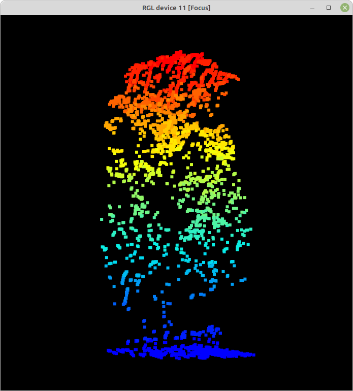

```{r setup, include=FALSE}
knitr::opts_chunk$set(
	echo = TRUE,
	message = FALSE,
	warning = FALSE
)
```
(usa ctrl + click para abrir enlaces en una nueva pestaña)

La rutina a continuación muestra un análisis simple de [datos LiDAR](https://www.wwf.org.uk/project/conservationtechnology/lidar) para obtener medidas de **estructura de la vegetación (arbórea y arbustiva)**. Concretamente uso coberturas correspondientes al territorio ocupado por el [Jardín Botánico Atlántico de Gijón](https://www.gijon.es/es/directorio/jardin-botanico-atlantico-de-gijon)

Los datos necesarios para desarrollar el ejemplo salen de tres archivos *.laz*: nubes de puntos LiDAR 3D, [descargados del IGN, LiDAR 2ª cobertura](http://centrodedescargas.cnig.es/CentroDescargas/buscadorCatalogo.do?codFamilia=LIDAR#). Cada archivo cubre 2 x 2 km, e incorporan coloración verdadera (RGB) derivada de las ortofotos. Están incluidos [en la carpeta comprimida 2catalog_botanico.zip](https://www.dropbox.com/scl/fi/keaer5i67xc6p8toqna9d/2catalog_botanico.zip?rlkey=eb3tmq74au5i71wx3pnnrstdk&dl=0). 
Los comandos a continuación asumen que las 3 coberturas *.laz* están en una carpeta llamada "2catalog_botanico", y esta a su vez en el directorio de trabajo de R (`setwd()`).

La rutina usa la librería *lidR*, siguiendo en gran medida los [procedimientos descritos por el autor de la misma](https://github.com/r-lidar/lidR). Los pasos iniciales serán instalar la librería, y a continuación cargarla en la sesión de R:
```{r}
library(lidR)
```

**lidR** permite leer y escribir formatos habutuales de coberturas LiDAR, *.las* y *.laz*.

La función `catalog` a continuación construye un mosaico virtual de los 3 archivos *.laz* de 2 x 2 km descargados. Un `catalog` es un esquema simple de los datos disponibles, que ocupando muy poca memoria permite trabajar a la vez con múltiples archivos *.laz* (o *.las*):

```{r}
mosaico.botanico <- catalog("2catalog_botanico")
plot(mosaico.botanico)
```

La **extracción** de partes del mosaico se puede realizar con las distintas funciones `clip`disponibles en **lidR**. `clip` extrae parte de la nube de puntos, guardándola a su vez memoria en formato *.las*. 
A continuación, dos ejemplos de extracción de partes del mosaico: un fragmento circular de la Carbayeda del Botánico, y un rectángulo incluyendo todos los terrenos del Botánico. Las coordenadas son las originales del conjunto de datos, en este caso UTM 30N. En ambos casos la función `plot` simula 3D, permitiendo rotar e inclinar la nube de puntos:

```{r plot carbayeda}
carbayeda <- clip_circle(mosaico.botanico, 288115, 4821807, radius = 50)
plot(carbayeda) 
```


```{r plot botanico}
todo.botanico <- clip_rectangle(mosaico.botanico, 287676,4821673, 288937,4822128)  
plot(todo.botanico, bg="white") 
```


Los autores de la librería **lidR** (enlace arriba) tienen también un visor de nubes de puntos mucho más ágil, si bien a diferencia del estándar requiere cerrar el visor antes de procesar otro código R. Requiere la instalación de [la librería adicional *lidRviewer*](https://github.com/Jean-Romain/lidRviewer). Usa por defecto la altura (Z) de los puntos como variable para colorear la nube de puntos:

```{r eval=FALSE}
plot(todo.botanico, backend="lidRviewer")
```

A continuación podemos usar funciones para evaluar la condición general del conjunto de datos. Concretamente `las_check()` repasa diversos indicadores interesantes, entre ellos si los datos están normalizados (más detalle debajo), o si existen muchos puntos duplicados.

```{r lascheck, eval=FALSE}
las_check(todo.botanico)
str(todo.botanico@data)
summary(todo.botanico$Z)
```

La estadística descriptiva simple de `summary(todo.botanico$Z)` se refiere a la variable **Z** de los datos: la altura de los puntos sobre el nivel del mar, incluyendo el terreno y la vegetación (o infraestructuras).

### Normalizando alturas de la vegetación
Para analizar la estructura de la vegetación puede ser interesante eliminar la influencia de la elevación del terreno, refiriendo la altura de cada punto de la vegetación a 0 metros. Esa **normalización de las nubes de puntos** es el cometido de la función`normalize_height`, [que admite distintos métodos](https://r-lidar.github.io/lidRbook/norm.html). Tras normalizar los datos podemos aplicar `las_check` de nuevo, así como repasar la nueva distribución de valores de alturas (Z):
```{r results='hide'}
todo.botanico.norm <- normalize_height(todo.botanico, tin())
```

```{r results='hide'}
las_check(todo.botanico.norm)
```

```{r}
summary(todo.botanico.norm$Z)
```

La nueva descriptiva de las alturas Z muestra un valor mínimo negativo. Dado que en los valores no normalizados de altura no había valores menores de 0, los valores normalizados negativos son artefactos de la triangulación (asumo que debidos a bajas densidades de puntos "suelo"). Podemos prescindir de esos artefactos filtrando los valores de altura de la nube de puntos normalizada. Eso hace la función `filter_poi()`. La visualización de la nube de puntos normalizada con `plot()` mostraría ahora la vegetación sobre una "llanura perfecta" (no incluyo ese plot aquí, sí el código):
```{r plot botanico norm, eval=c(1)}
todo.botanico.norm <- filter_poi(todo.botanico.norm, Z >= 0)
plot(todo.botanico.norm, bg = "white", backend="lidRviewer")
```

### Modelo de alturas del dosel
A continuación elaboramos un modelo de altura del dosel. Será una cobertura [en formato ráster](https://docs.qgis.org/3.28/es/docs/gentle_gis_introduction/raster_data.html) representando los puntos más altos en cada pixel de los retornos LiDAR, la altura del dosel. Hay varios algoritmos posibles para obtener esos modelos; el código a continuación usa **point to raster**, especificado en`p2r()`, donde el argumento`subcircle = 0.2\` reemplaza cada dato LiDAR con un disco de radio conocido (20 cm), minimizando así los huecos:
```{r modelo dosel}
dosel.modelo <- rasterize_canopy(todo.botanico.norm, res=1, p2r(subcircle = 0.2), pkg="terra")
plot(dosel.modelo, col = height.colors(50))
```

### Suavizado del modelo del dosel - rellenando blancos
A continuación procesamos el modelo de altura del dosel para rellenar los blancos restantes. Las dos primeras líneas de código a continuación definen la función de suavizado, mientras que la 3ª lo lleva a cabo a través de la librería de manipulación ráster **terra**. La última línea exporta el ráster a un archivo GeoTiff - también vía **terra** - dejándolo disponible para usos en GIS:
```{r suave}
fill.na <- function(x, i=5) { if (is.na(x)[i]) { return(mean(x, na.rm = TRUE)) } 
  else { return(x[i]) }}
w <- matrix(1, 3, 3)
dosel.modelo.suave <- terra::focal (dosel.modelo, w, fun = mean, na.rm = TRUE)
terra::writeRaster(dosel.modelo.suave, "dosel.modelo.tif", overwrite=T)
```

### Detección de árboles
A partir del modelo del dosel arbóreo continuamos con un procedimiento para *individualizar* árboles y arbustos de la nube de puntos LiDAR. Es el cometido de la función `locate_trees()`:
```{r detecta copas}
copas.p2r.02 <- locate_trees(dosel.modelo.suave, lmf(ws = 10))  
```

### Segmentación de los árboles detectados
Hasta aquí hemos construido un modelo de la posición de árboles individuales en la nube de puntos, a partir del modelo del dosel. A continuación podemos segmentar la nube de puntos normalizada, **todo_botanico_norm**,  asignando un identificador individual a los puntos correspondientes a un árbol o arbusto concreto. De eso se encarga la función `segment_trees()`, que admite distintos algoritmos para cumplir el cometido. El código a continuación usa uno de ellos, `dalponte2016()`: 
```{r segmenta copas}
segmentos <- dalponte2016(dosel.modelo.suave, copas.p2r.02)
copas <- segment_trees (todo.botanico.norm, segmentos)
```

La nube de puntos segmentada **copas** incluye algunas estructuras no identificadas como árboles válidos. A continuación nos quedamos solo con aquellos puntos que incorporan un identificador *árbol* válido. El resumen `summary()` indica na altura media de 9.3 m, y sugiere que el árbol más alto del Botánico mide - medía en el momento de tomar los datos - 47 m:  
```{r reten solo arbol}
arboles <- filter_poi(copas, !is.na(treeID))
summary(arboles$Z)
plot(arboles, bg = "white", size = 4, color = "treeID")
```


### Extrayendo árboles individuales
De la nube de puntos de árboles individualizados podemos extraer - si es útil y/o divertido - la nube de puntos correspondiente a un árbol concreto. A continuación ilustro esto a partir del árbol más alto del modelo del Botánico, un *Eucalyptus globulus* de 47 m: 
```{r extrae okalito}
okaliton <- filter_poi(arboles, treeID == 747)
plot(okaliton, size = 5, bg = "black")
```
.

Una vez extraidos, esos modelos individuales de árboles son nubes de datos, de las que podemos extraer información de la manera habitual: `summary()` nos puede devolver información sobre la propia nube de puntos, y sobre variables concretas en ella, como la altura (Z). Una información relevante para evaluar la capacidad de los datos es la densidad de puntos y pulsos por m^2^:
```{r okaliton 2, eval=c(2), echo=1:2}
summary(okaliton)
summary(okaliton@data$Z)
```

### Extrayendo métricas

####  A nivel de árbol
La función `crown_metrics()` devuelve métricas de árboles (copas) individuales. La función incluye al menos dos argumentos - la nube de puntos de interés, y la función a extraer; a continuación *pedimos* la altura media de cada árbol:
```{r}
Z.media.arbol <- crown_metrics(arboles, func = ~mean(Z))
```

A continuación operamos simplemente para renombrar la variable 'media' obtenida:
```{r}
Z.media.arbol$zmedia <- Z.media.arbol$V1
Z.media.arbol$V1 <- NULL
head(Z.media.arbol)
```

De la misma forma obtenemos la altura máxima, la desviación estándar de Z, y el número de retornos de los pulsos LiDAR por cada árbol, como medidas relacionadas con la **complejidad estructural** de la vegetación:
```{r}
Z.max.arbol <- crown_metrics(arboles, func = ~max(Z))
Z.max.arbol$zmax <- Z.max.arbol$V1
Z.max.arbol$V1 <- NULL

Z.sd.arbol <- crown_metrics(arboles, func = ~sd(Z))
Z.sd.arbol$zsd <- Z.sd.arbol$V1
Z.sd.arbol$V1 <- NULL

n.retornos <- crown_metrics(arboles, func = ~length(ReturnNumber))
n.retornos$nretornos <- n.retornos$V1
n.retornos$V1 <- NULL
```

Finalmente combinamos las métricas extraidas en un único conjunto de datos, reteniendo solo las columnas de interés:
```{r}
arboles.metrica <- cbind(Z.media.arbol, Z.max.arbol, Z.sd.arbol, n.retornos)
arboles.metrica <- arboles.metrica[,c(1,2,4,6,8,9)]
head(arboles.metrica)
```

El procedimiento anterior se puede simplificar: las métricas más comunes están pre-definidas en el argumento `func = .stdmetrics`, si bien esa opción ofrece una salida muy prolija:
```{r results='hide'}
arboles.metrica.2 <- crown_metrics(arboles, func = .stdmetrics)
```

####  A nivel de parcela
Puede resulta útil en ocasiones evaluar la estructura de la vegetación en una parcela de tamaño determinado. Es un procedimiento habitual en inventarios forestales, y es frecuente también cuando evaluamos el uso de hábitat por parte de animales. 
En este caso utilizaremos 4 puntos de interés, para los que tenemos grabaciones de vocalizaciones de aves.
La librería **lidR** incluye la función `plot_metrics()` para facilitar la extracción de métricas *tipo inventario*. La función requiere especificar la nube de puntos LiDAR, las métricas que queremos extraer, la localización de las parcelas, y el radio de las mismas. La nube de puntos aquí es la de la vegetación normalizada, sin incluir segmentación en árboles individuales (i.e. **todo_botanico_norm**). 

Para manejar la localización de las parcelas, importamos una capa de puntos, en este caso 4; el formato utilizado es el viejo formato vectorial *shapefile* (extensión *shp*), disponible como .zip [en este repositorio](https://github.com/quevedomario/dosel-botanico/tree/main):  
```{r}
parcelas <- sf::st_read("parcelas.shp", quiet = TRUE)
```

A continuación pedimos por eficiencia el lote completo de métrica estándar, visto arriba, del que nos interesarán solo unas pocas variables indicadoras de estructura de vegetación. Usamos parcelas de 20 m de radio (1257 m^2^). Las tres primeras métricas disponibles son *zmax*, *zmean*, y *zsd*, i.e. altura máxima, media, y desviación estándar en cada parcela: 
```{r}
metricas <- plot_metrics(todo.botanico.norm, func = .stdmetrics, parcelas, radius = 20)
head(metricas)
```