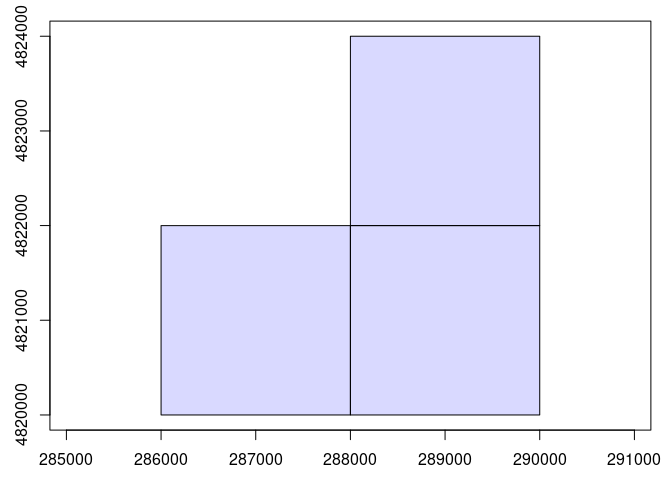
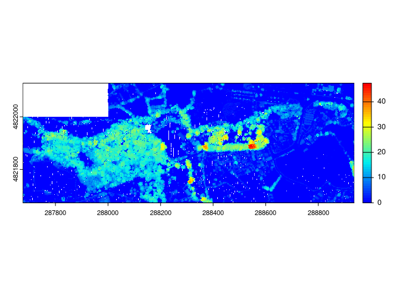

Modelos de dosel arbóreo a partir de LiDAR
================
Mario Quevedo
Marzo 2024

## Estructura de la vegetación (arbórea y arbustiva) en el [Jardín Botánico Atlántico de Gijón](https://www.gijon.es/es/directorio/jardin-botanico-atlantico-de-gijon)

Procedimiento desarrollado con la librería *lidR*, siguiendo en gran
medida las [rutinas descritas por el autor de la
misma](https://github.com/r-lidar/lidR).

``` r
library(lidR)
```

La librería permite leer y escribir los formatos .las y .laz, e incluye
funciones a distinto nivel de organización de datos.

Los datos necesarios para desarrollar este ejemplo son tres archivos
.laz de nubes de puntos LiDAR 3D, [descargados del
IGN](https://centrodedescargas.cnig.es/CentroDescargas/busquedaSerie.do?codSerie=MLID2#).
Cada archivo cubre 2 x 2 km, e incluyen coloración verdadera (RGB).
Están incluidos [en la carpeta comprimida
2catalog_botanico.zip](https://www.dropbox.com/scl/fi/keaer5i67xc6p8toqna9d/2catalog_botanico.zip?rlkey=eb3tmq74au5i71wx3pnnrstdk&dl=0)
El comando `catalog` a continuación construye un mosaico virtual de las
3 coberturas 2 x 2 km:

``` r
mosaico.botanico <- catalog("2catalog_botanico")
```

Un `catalog` es un esquema simple de los datos disponibles, sin ocupar
apenas memoria:

``` r
plot(mosaico.botanico)
```

<!-- -->

La **extracción** de partes del mosaico se puede realizar con las
distintas funciones `clip`disponibles en **lidR**. A continuación, dos
ejemplos; un fragmento circular correspondiente a la Carbayeda, y un
rectángulo de datos incluyendo todos los terrenos del Botánico. Las
coordenadas son las originales del conjunto de datos, en este caso UTM
30N. En ambos casos la función `plot` muestra y permite rotar e inclinar
la nube de puntos:

``` r
carbayeda <- clip_circle(mosaico.botanico, 288115, 4821807, radius = 50)
## plot(carbayeda)
todo.botanico <- clip_rectangle(mosaico.botanico, 287676,4821673, 288937,4822128)
## plot(todo.botanico, bg="white")
```

<figure>

<figcaption aria-hidden="true">optional caption text</figcaption>
</figure>

<figure>

<figcaption aria-hidden="true">optional caption text</figcaption>
</figure>

Los autores de la librería **lidR** (enlace arriba) tienen también un
visor de nubes de puntos mucho más ágil, si bien a diferencia del
estándar requiere cerrar el visor antes de procesar más código R;
requiere la instalación de la librería adicional *lidRviewer*:

``` r
plot(todo.botanico, backend="lidRviewer") # default = Z
```

A continuación podemos usar funciones para evaluar la condición general
del conjunto de datos. Concretamente `las_check()` repasa diversos
indicadores interesantes, entre ellos si los datos están normalizados
(elaboro debajo), o si existen muchos puntos duplicados.

    ## 
    ##  Checking the data
    ##   - Checking coordinates... ✓
    ##   - Checking coordinates type... ✓
    ##   - Checking coordinates range... ✓
    ##   - Checking coordinates quantization... ✓
    ##   - Checking attributes type... ✓
    ##   - Checking ReturnNumber validity... ✓
    ##   - Checking NumberOfReturns validity... ✓
    ##   - Checking ReturnNumber vs. NumberOfReturns... ✓
    ##   - Checking RGB validity... ✓
    ##   - Checking absence of NAs... ✓
    ##   - Checking duplicated points...
    ##     ⚠ 32 points are duplicated and share XYZ coordinates with other points
    ##   - Checking degenerated ground points... ✓
    ##   - Checking attribute population... ✓
    ##   - Checking gpstime incoherances ✓
    ##   - Checking flag attributes... ✓
    ##   - Checking user data attribute... ✓
    ##  Checking the header
    ##   - Checking header completeness... ✓
    ##   - Checking scale factor validity... ✓
    ##   - Checking point data format ID validity... ✓
    ##   - Checking extra bytes attributes validity... ✓
    ##   - Checking the bounding box validity... ✓
    ##   - Checking coordinate reference system... ✓
    ##  Checking header vs data adequacy
    ##   - Checking attributes vs. point format... ✓
    ##   - Checking header bbox vs. actual content... ✓
    ##   - Checking header number of points vs. actual content... ✓
    ##   - Checking header return number vs. actual content... ✓
    ##  Checking coordinate reference system...
    ##   - Checking if the CRS was understood by R... ✓
    ##  Checking preprocessing already done 
    ##   - Checking ground classification... yes
    ##   - Checking normalization... no
    ##   - Checking negative outliers... ✓
    ##   - Checking flightline classification... yes
    ##  Checking compression
    ##   - Checking attribute compression...
    ##    -  Synthetic_flag is compressed
    ##    -  Keypoint_flag is compressed
    ##    -  Withheld_flag is compressed
    ##    -  Overlap_flag is compressed
    ##    -  UserData is compressed

    ## Classes 'data.table' and 'data.frame':   1716035 obs. of  21 variables:
    ##  $ X                : num  287998 287996 287997 287998 287997 ...
    ##  $ Y                : num  4821687 4821694 4821716 4821735 4821706 ...
    ##  $ Z                : num  37.1 35.4 28.6 36.2 36.8 ...
    ##  $ gpstime          : num  2.9e+08 2.9e+08 2.9e+08 2.9e+08 2.9e+08 ...
    ##  $ Intensity        : int  124 126 126 102 11 72 13 33 104 12 ...
    ##  $ ReturnNumber     : int  1 1 1 1 1 2 1 2 4 1 ...
    ##  $ NumberOfReturns  : int  2 1 1 1 2 2 4 3 4 4 ...
    ##  $ ScanDirectionFlag: int  0 0 0 1 1 0 0 0 1 0 ...
    ##  $ EdgeOfFlightline : int  0 0 0 0 0 0 0 0 0 0 ...
    ##  $ Classification   : int  6 6 2 5 5 2 5 5 2 5 ...
    ##  $ ScannerChannel   : int  0 0 0 0 0 0 0 0 0 0 ...
    ##  $ Synthetic_flag   : logi  FALSE FALSE FALSE FALSE FALSE FALSE ...
    ##  $ Keypoint_flag    : logi  FALSE FALSE FALSE FALSE FALSE FALSE ...
    ##  $ Withheld_flag    : logi  FALSE FALSE FALSE FALSE FALSE FALSE ...
    ##  $ Overlap_flag     : logi  FALSE FALSE FALSE FALSE FALSE FALSE ...
    ##  $ ScanAngle        : num  -15 -15 -16 -16 -15 ...
    ##  $ UserData         : int  0 0 0 0 0 0 0 0 0 0 ...
    ##  $ PointSourceID    : int  30 30 30 30 30 30 30 30 30 30 ...
    ##  $ R                : int  10240 40192 9728 11008 10752 25344 31744 21504 31488 40704 ...
    ##  $ G                : int  12800 43520 14848 11520 10752 29696 34048 30976 36352 40448 ...
    ##  $ B                : int  24576 45824 26880 20480 19968 26112 30976 34560 35840 40192 ...
    ##  - attr(*, ".internal.selfref")=<externalptr>

``` r
summary(todo.botanico$Z)
```

    ##    Min. 1st Qu.  Median    Mean 3rd Qu.    Max. 
    ##   11.39   24.68   29.35   29.67   33.35   74.16

*INTERPRETAR summary()*

### Normalizando alturas de la vegetación

Hasta el momento el parámetro *Z* en el conjunto de datos recoje la
altura de cada punto sobre el nivel del mar. Sin embargo para analizr
estructura de la vegetación puede ser interesante **normalizar las nubes
de puntos**, eliminando la influencia de la altura del terreno. Es el
cometido de `normalize_height`, [que admite distintos
métodos](https://r-lidar.github.io/lidRbook/norm.html).

Tras normalizar los datos podemos aplicar `las_check` de nuevo, así como
repasar la nueva distribución de valores de alturas (Z):

``` r
todo.botanico.norm <- normalize_height(todo.botanico, tin())
```

    ## Delaunay rasterization[=================================-----------------] 67% (2 threads)Delaunay rasterization[==================================----------------] 68% (2 threads)Delaunay rasterization[==================================----------------] 69% (2 threads)Delaunay rasterization[===================================---------------] 70% (2 threads)Delaunay rasterization[===================================---------------] 71% (2 threads)Delaunay rasterization[====================================--------------] 72% (2 threads)Delaunay rasterization[====================================--------------] 73% (2 threads)Delaunay rasterization[=====================================-------------] 74% (2 threads)Delaunay rasterization[=====================================-------------] 75% (2 threads)Delaunay rasterization[======================================------------] 76% (2 threads)Delaunay rasterization[======================================------------] 77% (2 threads)Delaunay rasterization[=======================================-----------] 78% (2 threads)Delaunay rasterization[=======================================-----------] 79% (2 threads)Delaunay rasterization[========================================----------] 80% (2 threads)Delaunay rasterization[========================================----------] 81% (2 threads)Delaunay rasterization[=========================================---------] 82% (2 threads)Delaunay rasterization[=========================================---------] 83% (2 threads)Delaunay rasterization[==========================================--------] 84% (2 threads)Delaunay rasterization[==========================================--------] 85% (2 threads)Delaunay rasterization[===========================================-------] 86% (2 threads)Delaunay rasterization[===========================================-------] 87% (2 threads)Delaunay rasterization[============================================------] 88% (2 threads)Delaunay rasterization[============================================------] 89% (2 threads)Delaunay rasterization[=============================================-----] 90% (2 threads)Delaunay rasterization[=============================================-----] 91% (2 threads)Delaunay rasterization[==============================================----] 92% (2 threads)Delaunay rasterization[==============================================----] 93% (2 threads)Delaunay rasterization[===============================================---] 94% (2 threads)Delaunay rasterization[===============================================---] 95% (2 threads)Delaunay rasterization[================================================--] 96% (2 threads)Delaunay rasterization[================================================--] 97% (2 threads)Delaunay rasterization[=================================================-] 98% (2 threads)Delaunay rasterization[=================================================-] 99% (2 threads)Delaunay rasterization[==================================================] 100% (2 threads)

``` r
## las_check(todo.botanico.norm)
summary(todo.botanico.norm$Z)
```

    ##    Min. 1st Qu.  Median    Mean 3rd Qu.    Max. 
    ##  -3.934   0.000   1.001   5.593  10.517  47.398

*VALORES NEGATIVOS!!*

``` r
todo.botanico.norm <- filter_poi(todo.botanico.norm, Z >= 0)
plot(todo.botanico.norm, bg = "white", backend="lidRviewer")
```

### Modelo de alturas del dosel

*p2r*

``` r
dosel.modelo1 <- rasterize_canopy(todo.botanico.norm, res=1, p2r(subcircle = 0.2), pkg="terra")
plot(dosel.modelo1, col = height.colors(50))
```

<!-- -->

### Suavizado del modelo - rellenando blancos

``` r
fill.na <- function(x, i=5) { if (is.na(x)[i]) { return(mean(x, na.rm = TRUE)) } else { return(x[i]) }}
w <- matrix(1, 3, 3)

dosel.modelo1.relleno <- terra::focal(dosel.modelo1, w, fun = fill.na)
dosel.modelo1.suavizado <- terra::focal(dosel.modelo1, w, fun = mean, na.rm = TRUE)

plot(dosel.modelo1.suavizado, col = height.colors(50))
```

<!-- -->

``` r
terra::writeRaster(dosel.modelo1.suavizado, "dosel.modelo1.tif", overwrite=T)
```

### Detección de árboles

*lmf 2 chm* Mayor valor de `ws=` menor número de árboles
individualizados

``` r
copas.p2r.02 <- locate_trees(dosel.modelo1.suavizado, lmf(ws = 10))  
plot(dosel.modelo1.suavizado, col = height.colors(50))
plot(sf::st_geometry(copas.p2r.02), add = TRUE, pch = 3)
```

<!-- -->

### Segmentación de los árboles detectados

***EXPLICAR…***

``` r
segmentos <- dalponte2016(dosel.modelo1.suavizado, copas.p2r.02)
arboles <- segment_trees (todo.botanico.norm, segmentos)
```

``` r
str(arboles@data)
```

    ## Classes 'data.table' and 'data.frame':   1588949 obs. of  23 variables:
    ##  $ X                : num  287998 287996 287997 287998 287997 ...
    ##  $ Y                : num  4821687 4821694 4821716 4821735 4821706 ...
    ##  $ Z                : num  7.22 5.86 0 8.41 7.67 ...
    ##  $ gpstime          : num  2.9e+08 2.9e+08 2.9e+08 2.9e+08 2.9e+08 ...
    ##  $ Intensity        : int  124 126 126 102 11 72 13 33 104 12 ...
    ##  $ ReturnNumber     : int  1 1 1 1 1 2 1 2 4 1 ...
    ##  $ NumberOfReturns  : int  2 1 1 1 2 2 4 3 4 4 ...
    ##  $ ScanDirectionFlag: int  0 0 0 1 1 0 0 0 1 0 ...
    ##  $ EdgeOfFlightline : int  0 0 0 0 0 0 0 0 0 0 ...
    ##  $ Classification   : int  6 6 2 5 5 2 5 5 2 5 ...
    ##  $ ScannerChannel   : int  0 0 0 0 0 0 0 0 0 0 ...
    ##  $ Synthetic_flag   : logi  FALSE FALSE FALSE FALSE FALSE FALSE ...
    ##  $ Keypoint_flag    : logi  FALSE FALSE FALSE FALSE FALSE FALSE ...
    ##  $ Withheld_flag    : logi  FALSE FALSE FALSE FALSE FALSE FALSE ...
    ##  $ Overlap_flag     : logi  FALSE FALSE FALSE FALSE FALSE FALSE ...
    ##  $ ScanAngle        : num  -15 -15 -16 -16 -15 ...
    ##  $ UserData         : int  0 0 0 0 0 0 0 0 0 0 ...
    ##  $ PointSourceID    : int  30 30 30 30 30 30 30 30 30 30 ...
    ##  $ R                : int  10240 40192 9728 11008 10752 25344 31744 21504 31488 40704 ...
    ##  $ G                : int  12800 43520 14848 11520 10752 29696 34048 30976 36352 40448 ...
    ##  $ B                : int  24576 45824 26880 20480 19968 26112 30976 34560 35840 40192 ...
    ##  $ Zref             : num  37.1 35.4 28.6 36.2 36.8 ...
    ##  $ treeID           : num  1424 NA NA 1280 1336 ...
    ##  - attr(*, ".internal.selfref")=<externalptr>

``` r
arboles <- filter_poi(arboles, !is.na(treeID))
summary(arboles$Z)
```

    ##    Min. 1st Qu.  Median    Mean 3rd Qu.    Max. 
    ##   0.000   3.488   9.342   9.781  15.133  47.398

``` r
plot(arboles, bg = "white", size = 4, color = "treeID")
```

### Extrayendo árboles individuales

``` r
okaliton <- filter_poi(arboles, treeID == 747)
plot(okaliton, size = 6, bg = "black")
```

<figure>

<figcaption aria-hidden="true">Nube de puntos correspondiente al gran
Eucaliptus globulus situado al SE del Botánico</figcaption>
</figure>

Una vez extraidos, esos modelos individuales de árboles son nubes de
datos, de las que podemos extraer información de la manera habitual:
`summary()` nos puede devolver información sobre la propia nube de
puntos, y sobre variables concretas en ella, como la altura (Z).

``` r
## summary(okaliton)
summary(okaliton@data$Z)
```

    ##    Min. 1st Qu.  Median    Mean 3rd Qu.    Max. 
    ##    0.00   19.88   34.33   29.65   42.96   47.40

### Extrayendo métricas

#### A nivel de árbol

``` r
Z.media.arbol <- tree_metrics(arboles, func = ~mean(Z))
View(Z.media.arbol@data)
n.retornos <- tree_metrics(arboles, func = ~length(ReturnNumber))
View(n.retornos@data)
```
