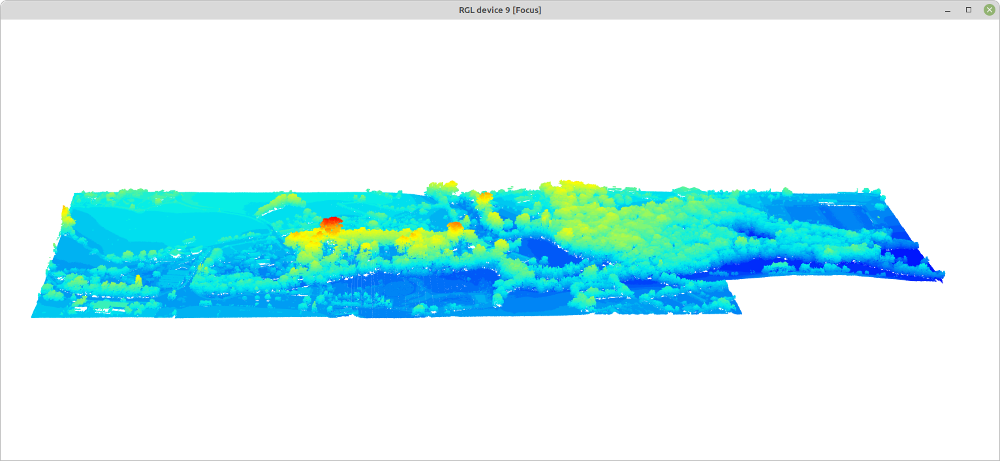
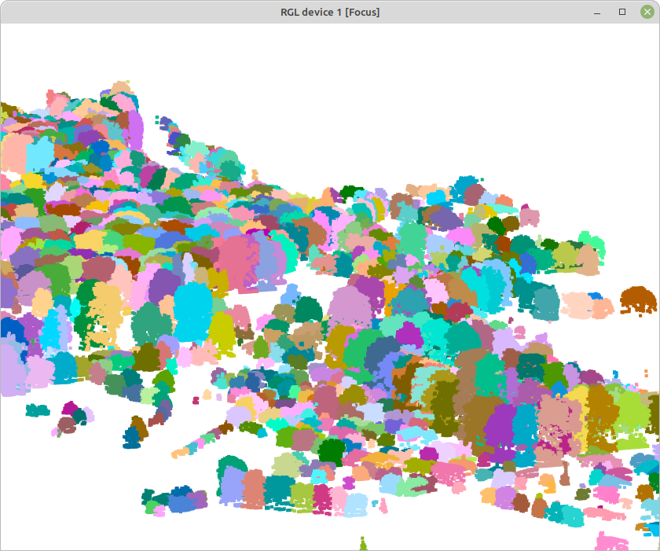

Modelos de dosel arbóreo a partir de LiDAR
================
Mario Quevedo
Marzo 2024

(usa ctrl + click para abrir enlaces en una nueva pestaña)

La rutina a continuación muestra un análisis simple de [datos
LiDAR](https://www.wwf.org.uk/project/conservationtechnology/lidar) para
obtener medidas de **estructura de la vegetación (arbórea y
arbustiva)**. Concretamente uso coberturas correspondientes al
territorio ocupado por el [Jardín Botánico Atlántico de
Gijón](https://www.gijon.es/es/directorio/jardin-botanico-atlantico-de-gijon)

Los datos necesarios para desarrollar el ejemplo salen de tres archivos
*.laz*: nubes de puntos LiDAR 3D, [descargados del IGN, LiDAR 2ª
cobertura](http://centrodedescargas.cnig.es/CentroDescargas/buscadorCatalogo.do?codFamilia=LIDAR#).
Cada archivo cubre 2 x 2 km, e incorporan coloración verdadera (RGB)
derivada de las ortofotos. Están incluidos [en la carpeta comprimida
2catalog_botanico.zip](https://www.dropbox.com/scl/fi/keaer5i67xc6p8toqna9d/2catalog_botanico.zip?rlkey=eb3tmq74au5i71wx3pnnrstdk&dl=0).
Los comandos a continuación asumen que las 3 coberturas *.laz* están en
una carpeta llamada “2catalog_botanico”, y esta a su vez en el
directorio de trabajo de R (`setwd()`).

La rutina usa la librería *lidR*, siguiendo en gran medida los
[procedimientos descritos por el autor de la
misma](https://github.com/r-lidar/lidR). Los pasos iniciales serán
instalar la librería, y a continuación cargarla en la sesión de R:

``` r
library(lidR)
```

**lidR** permite leer y escribir formatos habutuales de coberturas
LiDAR, *.las* y *.laz*.

La función `catalog` a continuación construye un mosaico virtual de los
3 archivos *.laz* de 2 x 2 km descargados. Un `catalog` es un esquema
simple de los datos disponibles, que ocupando muy poca memoria permite
trabajar a la vez con múltiples archivos *.laz* (o *.las*):

``` r
mosaico.botanico <- catalog("2catalog_botanico")
plot(mosaico.botanico)
```

<!-- -->

La **extracción** de partes del mosaico se puede realizar con las
distintas funciones `clip`disponibles en **lidR**. `clip` extrae parte
de la nube de puntos, guardándola a su vez memoria en formato *.las*. A
continuación, dos ejemplos de extracción de partes del mosaico: un
fragmento circular de la Carbayeda del Botánico, y un rectángulo
incluyendo todos los terrenos del Botánico. Las coordenadas son las
originales del conjunto de datos, en este caso UTM 30N. En ambos casos
la función `plot` simula 3D, permitiendo rotar e inclinar la nube de
puntos:

``` r
carbayeda <- clip_circle(mosaico.botanico, 288115, 4821807, radius = 50)
plot(carbayeda) 
```


``` r
todo.botanico <- clip_rectangle(mosaico.botanico, 287676,4821673, 288937,4822128)  
plot(todo.botanico, bg="white") 
```



Los autores de la librería **lidR** (enlace arriba) tienen también un
visor de nubes de puntos mucho más ágil, si bien a diferencia del
estándar requiere cerrar el visor antes de procesar otro código R.
Requiere la instalación de [la librería adicional
*lidRviewer*](https://github.com/Jean-Romain/lidRviewer). Usa por
defecto la altura (Z) de los puntos como variable para colorear la nube
de puntos:

``` r
plot(todo.botanico, backend="lidRviewer")
```

A continuación podemos usar funciones para evaluar la condición general
del conjunto de datos. Concretamente `las_check()` repasa diversos
indicadores interesantes, entre ellos si los datos están normalizados
(más detalle debajo), o si existen muchos puntos duplicados.

``` r
las_check(todo.botanico)
str(todo.botanico@data)
summary(todo.botanico$Z)
```

La estadística descriptiva simple de `summary(todo.botanico$Z)` se
refiere a la variable **Z** de los datos: la altura de los puntos sobre
el nivel del mar, incluyendo el terreno y la vegetación (o
infraestructuras).

### Normalizando alturas de la vegetación

Para analizar la estructura de la vegetación puede ser interesante
eliminar la influencia de la elevación del terreno, refiriendo la altura
de cada punto de la vegetación a 0 metros. Esa **normalización de las
nubes de puntos** es el cometido de la función`normalize_height`, [que
admite distintos métodos](https://r-lidar.github.io/lidRbook/norm.html).
Tras normalizar los datos podemos aplicar `las_check` de nuevo, así como
repasar la nueva distribución de valores de alturas (Z):

``` r
todo.botanico.norm <- normalize_height(todo.botanico, tin())
```

``` r
las_check(todo.botanico.norm)
```

``` r
summary(todo.botanico.norm$Z)
```

    ##    Min. 1st Qu.  Median    Mean 3rd Qu.    Max. 
    ##  -3.934   0.000   1.001   5.593  10.517  47.398

La nueva descriptiva de las alturas Z muestra un valor mínimo negativo.
Dado que en los valores no normalizados de altura no había valores
menores de 0, los valores normalizados negativos son artefactos de la
triangulación (asumo que debidos a bajas densidades de puntos “suelo”).
Podemos prescindir de esos artefactos filtrando los valores de altura de
la nube de puntos normalizada. Eso hace la función `filter_poi()`. La
visualización de la nube de puntos normalizada con `plot()` mostraría
ahora la vegetación sobre una “llanura perfecta” (no incluyo ese plot
aquí, sí el código):

``` r
todo.botanico.norm <- filter_poi(todo.botanico.norm, Z >= 0)
## plot(todo.botanico.norm, bg = "white", backend="lidRviewer")
```

### Modelo de alturas del dosel

A continuación elaboramos un modelo de altura del dosel. Será una
cobertura [en formato
ráster](https://docs.qgis.org/3.28/es/docs/gentle_gis_introduction/raster_data.html)
representando los puntos más altos en cada pixel de los retornos LiDAR,
la altura del dosel. Hay varios algoritmos posibles para obtener esos
modelos; el código a continuación usa **point to raster**, especificado
en`p2r()`, donde el argumento`subcircle = 0.2\` reemplaza cada dato
LiDAR con un disco de radio conocido (20 cm), minimizando así los
huecos:

``` r
dosel.modelo <- rasterize_canopy(todo.botanico.norm, res=1, p2r(subcircle = 0.2), pkg="terra")
plot(dosel.modelo, col = height.colors(50))
```

<!-- -->

### Suavizado del modelo del dosel - rellenando blancos

A continuación procesamos el modelo de altura del dosel para rellenar
los blancos restantes. Las dos primeras líneas de código a continuación
definen la función de suavizado, mientras que la 3ª lo lleva a cabo a
través de la librería de manipulación ráster **terra**. La última línea
exporta el ráster a un archivo GeoTiff - también vía **terra** -
dejándolo disponible para usos en GIS:

``` r
fill.na <- function(x, i=5) { if (is.na(x)[i]) { return(mean(x, na.rm = TRUE)) } 
  else { return(x[i]) }}
w <- matrix(1, 3, 3)
dosel.modelo.suave <- terra::focal (dosel.modelo, w, fun = mean, na.rm = TRUE)
terra::writeRaster(dosel.modelo.suave, "dosel.modelo.tif", overwrite=T)
```

### Detección de árboles

A partir del modelo del dosel arbóreo continuamos con un procedimiento
para *individualizar* árboles y arbustos de la nube de puntos LiDAR. Es
el cometido de la función `locate_trees()`:

``` r
copas.p2r.02 <- locate_trees(dosel.modelo.suave, lmf(ws = 10))  
```

### Segmentación de los árboles detectados

Hasta aquí hemos construido un modelo de la posición de árboles
individuales en la nube de puntos, a partir del modelo del dosel. A
continuación podemos segmentar la nube de puntos normalizada,
**todo_botanico_norm**, asignando un identificador individual a los
puntos correspondientes a un árbol o arbusto concreto. De eso se encarga
la función `segment_trees()`, que admite distintos algoritmos para
cumplir el cometido. El código a continuación usa uno de ellos,
`dalponte2016()`:

``` r
segmentos <- dalponte2016(dosel.modelo.suave, copas.p2r.02)
copas <- segment_trees (todo.botanico.norm, segmentos)
```

La nube de puntos segmentada **copas** incluye algunas estructuras no
identificadas como árboles válidos. A continuación nos quedamos solo con
aquellos puntos que incorporan un identificador *árbol* válido. El
resumen `summary()` indica na altura media de 9.3 m, y sugiere que el
árbol más alto del Botánico mide - medía en el momento de tomar los
datos - 47 m:

``` r
arboles <- filter_poi(copas, !is.na(treeID))
summary(arboles$Z)
```

    ##    Min. 1st Qu.  Median    Mean 3rd Qu.    Max. 
    ##   0.000   3.488   9.342   9.781  15.133  47.398

``` r
plot(arboles, bg = "white", size = 4, color = "treeID")
```

<figure>

<figcaption aria-hidden="true">Árboles individualizados</figcaption>
</figure>

### Extrayendo árboles individuales

De la nube de puntos de árboles individualizados podemos extraer - si es
útil y/o divertido - la nube de puntos correspondiente a un árbol
concreto. A continuación ilustro esto a partir del árbol más alto del
modelo del Botánico, un *Eucalyptus globulus* de 47 m:

``` r
okaliton <- filter_poi(arboles, treeID == 747)
plot(okaliton, size = 5, bg = "black")
```

.

Una vez extraidos, esos modelos individuales de árboles son nubes de
datos, de las que podemos extraer información de la manera habitual:
`summary()` nos puede devolver información sobre la propia nube de
puntos, y sobre variables concretas en ella, como la altura (Z). Una
información relevante para evaluar la capacidad de los datos es la
densidad de puntos y pulsos por m<sup>2</sup>:

``` r
## summary(okaliton)
summary(okaliton@data$Z)
```

    ##    Min. 1st Qu.  Median    Mean 3rd Qu.    Max. 
    ##    0.00   19.88   34.33   29.65   42.96   47.40

### Extrayendo métricas

#### A nivel de árbol

La función `crown_metrics()` devuelve métricas de árboles (copas)
individuales. La función incluye al menos dos argumentos - la nube de
puntos de interés, y la función a extraer; a continuación *pedimos* la
altura media de cada árbol:

``` r
Z.media.arbol <- crown_metrics(arboles, func = ~mean(Z))
```

A continuación operamos simplemente para renombrar la variable ‘media’
obtenida:

``` r
Z.media.arbol$zmedia <- Z.media.arbol$V1
Z.media.arbol$V1 <- NULL
head(Z.media.arbol)
```

    ## Simple feature collection with 6 features and 2 fields
    ## Geometry type: POINT
    ## Dimension:     XYZ
    ## Bounding box:  xmin: 288175.9 ymin: 4822120 xmax: 288834.9 ymax: 4822128
    ## z_range:       zmin: 3.803 zmax: 16.264
    ## Projected CRS: GCS_ETRS_1989
    ##   treeID                       geometry    zmedia
    ## 1      3 POINT Z (288432 4822127 16.... 10.632250
    ## 2      5 POINT Z (288811.6 4822128 1...  5.270444
    ## 3      7 POINT Z (288800.5 4822126 1...  4.353821
    ## 4      8 POINT Z (288834.9 4822126 4...  1.458667
    ## 5      9 POINT Z (288698 4822125 3.803)  1.231250
    ## 6     10 POINT Z (288175.9 4822120 4...  3.594292

De la misma forma obtenemos la altura máxima, la desviación estándar de
Z, y el número de retornos de los pulsos LiDAR por cada árbol, como
medidas relacionadas con la **complejidad estructural** de la
vegetación:

``` r
Z.max.arbol <- crown_metrics(arboles, func = ~max(Z))
Z.max.arbol$zmax <- Z.max.arbol$V1
Z.max.arbol$V1 <- NULL

Z.sd.arbol <- crown_metrics(arboles, func = ~sd(Z))
Z.sd.arbol$zsd <- Z.sd.arbol$V1
Z.sd.arbol$V1 <- NULL

n.retornos <- crown_metrics(arboles, func = ~length(ReturnNumber))
n.retornos$nretornos <- n.retornos$V1
n.retornos$V1 <- NULL
```

Finalmente combinamos las métricas extraidas en un único conjunto de
datos, reteniendo solo las columnas de interés:

``` r
arboles.metrica <- cbind(Z.media.arbol, Z.max.arbol, Z.sd.arbol, n.retornos)
arboles.metrica <- arboles.metrica[,c(1,2,4,6,8,9)]
head(arboles.metrica)
```

    ## Simple feature collection with 6 features and 5 fields
    ## Geometry type: POINT
    ## Dimension:     XYZ
    ## Bounding box:  xmin: 288175.9 ymin: 4822120 xmax: 288834.9 ymax: 4822128
    ## z_range:       zmin: 3.803 zmax: 16.264
    ## Projected CRS: GCS_ETRS_1989
    ##   treeID    zmedia   zmax       zsd nretornos                       geometry
    ## 1      3 10.632250 16.264 7.2628748         4 POINT Z (288432 4822127 16....
    ## 2      5  5.270444 11.142 4.3771419         9 POINT Z (288811.6 4822128 1...
    ## 3      7  4.353821 10.280 2.9756124       140 POINT Z (288800.5 4822126 1...
    ## 4      8  1.458667  4.095 1.5438148         9 POINT Z (288834.9 4822126 4...
    ## 5      9  1.231250  3.803 1.7942303         4 POINT Z (288698 4822125 3.803)
    ## 6     10  3.594292  4.544 0.9306946        96 POINT Z (288175.9 4822120 4...

El procedimiento anterior se puede simplificar: las métricas más comunes
están pre-definidas en el argumento `func = .stdmetrics`, si bien esa
opción ofrece una salida muy prolija:

``` r
arboles.metrica.2 <- crown_metrics(arboles, func = .stdmetrics)
```

#### A nivel de parcela

Puede resulta útil en ocasiones evaluar la estructura de la vegetación
en una parcela de tamaño determinado. Es un procedimiento habitual en
inventarios forestales, y es frecuente también cuando evaluamos el uso
de hábitat por parte de animales. En este caso utilizaremos 4 puntos de
interés, para los que tenemos grabaciones de vocalizaciones de aves. La
librería **lidR** incluye la función `plot_metrics()` para facilitar la
extracción de métricas *tipo inventario*. La función requiere
especificar la nube de puntos LiDAR, las métricas que queremos extraer,
la localización de las parcelas, y el radio de las mismas. La nube de
puntos aquí es la de la vegetación normalizada, sin incluir segmentación
en árboles individuales (i.e. **todo_botanico_norm**).

Para manejar la localización de las parcelas, importamos una capa de
puntos, en este caso 4; el formato utilizado es el viejo formato
vectorial *shapefile* (extensión *shp*), disponible como .zip [en este
repositorio](https://github.com/quevedomario/dosel-botanico/tree/main):

``` r
parcelas <- sf::st_read("parcelas.shp", quiet = TRUE)
```

A continuación pedimos por eficiencia el lote completo de métrica
estándar, visto arriba, del que nos interesarán solo unas pocas
variables indicadoras de estructura de vegetación. Usamos parcelas de 20
m de radio (1257 m<sup>2</sup>). Las tres primeras métricas disponibles
son *zmax*, *zmean*, y *zsd*, i.e. altura máxima, media, y desviación
estándar en cada parcela:

``` r
metricas <- plot_metrics(todo.botanico.norm, func = .stdmetrics, parcelas, radius = 20)
head(metricas)
```

    ## Simple feature collection with 4 features and 58 fields
    ## Geometry type: POINT
    ## Dimension:     XYZ
    ## Bounding box:  xmin: 288032.5 ymin: 4821808 xmax: 288670.4 ymax: 4822046
    ## z_range:       zmin: 17.39 zmax: 28.37
    ## Projected CRS: ETRS89 / UTM zone 30N
    ##   fid                    Name   zmax       zmean       zsd      zskew     zkurt
    ## 1   1            AM 1 Aliseda 25.313 11.55608718 7.0624704 -0.4119368  1.877256
    ## 2   2          AM 2 Carbayeda 20.920  8.58605898 6.3619510 -0.1735331  1.655536
    ## 3   3   AM 3 Boreal Americano  2.604  0.06507261 0.2762201  5.9595291 42.019796
    ## 4   4 AM 4 Entorno Cantábrico 14.629  4.86628904 4.2888321  0.1841146  1.614224
    ##    zentropy pzabovezmean   pzabove2 zq5  zq10   zq15  zq20  zq25   zq30   zq35
    ## 1 0.9058774     57.69189 81.8803604   0 0.027 0.2185 3.063 5.661 7.6870 9.5405
    ## 2 0.8531213     56.41404 71.3211442   0 0.000 0.0000 0.008 0.058 3.4072 6.1877
    ## 3 0.1034080     11.75657  0.6224066   0 0.000 0.0000 0.000 0.000 0.0000 0.0000
    ## 4 0.8302401     50.06605 63.1704095   0 0.000 0.0000 0.000 0.000 0.0000 0.9388
    ##      zq40     zq45   zq50    zq55    zq60    zq65    zq70     zq75    zq80
    ## 1 11.0040 12.19200 13.154 14.2005 15.0030 15.7815 16.6410 17.49350 18.1960
    ## 2  7.7374  8.96445 10.038 10.9180 11.6656 12.4440 13.1000 13.86475 14.5658
    ## 3  0.0000  0.00000  0.000  0.0000  0.0000  0.0000  0.0000  0.00000  0.0000
    ## 4  2.8706  3.99160  4.883  5.8246  6.6858  7.4438  8.0424  8.72600  9.2610
    ##      zq85    zq90     zq95    zpcum1   zpcum2   zpcum3   zpcum4   zpcum5
    ## 1 19.0155 19.7750 20.72100 12.307149 17.20645 23.78990 31.28018 43.03380
    ## 2 15.3334 16.2116 17.61900 11.536349 14.35634 19.61179 28.85918 40.48709
    ## 3  0.0000  0.0955  0.35275 47.126437 71.83908 81.03448 84.48276 86.20690
    ## 4  9.8526 10.6340 11.61100  7.401755 13.81152 23.80771 35.29187 47.99695
    ##     zpcum6   zpcum7   zpcum8   zpcum9   itot imax     imean      isd     iskew
    ## 1 57.90837 74.31398 92.23884 99.23448 433404  230  47.05287 40.64848  1.541213
    ## 2 57.40707 75.70042 90.16664 96.68559 447249  297  65.94648 51.40889  1.443781
    ## 3 90.22989 93.10345 97.12644 98.85057 318790  330 220.46335 70.90240 -0.866889
    ## 4 64.59367 82.33499 93.24685 98.43571 214073  311  56.55826 50.73028  1.654000
    ##      ikurt ipground ipcumzq10 ipcumzq30 ipcumzq50 ipcumzq70 ipcumzq90     p1th
    ## 1 4.808919 11.76085  15.73151  36.16303  52.87838  73.00740  91.92555 44.46857
    ## 2 5.205257 25.88178  25.98933  38.09086  53.01812  70.07282  89.89579 44.27897
    ## 3 2.833593 91.10167  91.10167  91.10167  91.10167  91.10167  93.28053 98.27109
    ## 4 5.743933 48.33632  48.33632  48.33632  64.00153  75.49341  91.25252 41.58520
    ##        p2th     p3th     p4th      p5th   pground    n     area
    ## 1 31.798936 16.68657 5.916839 1.1290848  7.729888 9211 1581.627
    ## 2 34.178708 16.13093 4.718372 0.6930109 19.389561 6782 1580.439
    ## 3  1.728907  0.00000 0.000000 0.0000000 87.897649 1446 1563.411
    ## 4 32.734478 17.83355 6.499339 1.3474240 30.726552 3785 1576.884
    ##                         geometry
    ## 1 POINT Z (288032.5 4821902 1...
    ## 2 POINT Z (288117.1 4821808 2...
    ## 3 POINT Z (288360.5 4822046 2...
    ## 4 POINT Z (288670.4 4822006 2...
